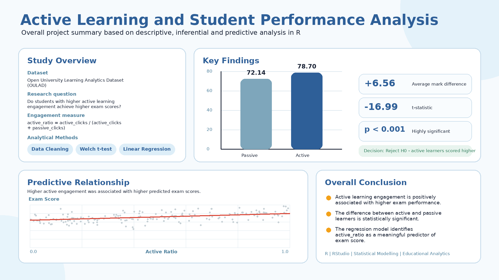

# Active Learning and Student Performance Analysis

## Project Overview

This project examines the impact of active and passive learning engagement on student academic performance.

It was completed as part of the **Theory and Practices in Statistical Modelling** module at the Sri Lanka Institute of Information Technology (SLIIT).

The study applies descriptive, inferential, and predictive analytical methods using R to investigate whether students with higher active learning engagement achieve better exam results.

## Project Preview

## Research Question

**Do students with higher active learning engagement achieve higher exam scores?**

## Hypotheses

- **Null Hypothesis (H0):** The mean exam score is the same for active and passive learners.
- **Alternative Hypothesis (H1):** Active learners achieve higher mean exam scores.
- **Significance Level:** α = 0.05

## Dataset

The project uses the **Open University Learning Analytics Dataset (OULAD)**.

The dataset includes:

- Student assessment scores
- Virtual learning environment interactions
- Student demographic information
- Learning activity records
- Student-level academic performance data

The dataset was selected because it contains detailed information about student engagement and academic performance.

## Variables

### Independent Variable

**Active Ratio**

The active ratio measures the proportion of active student interactions compared with total learning interactions.

`active_ratio = active_clicks / (active_clicks + passive_clicks)`

### Dependent Variable

**Exam Score**

Exam scores were used as the numerical measure of student academic performance and comprehension.

## Active and Passive Learning Activities

### Active Activities

Active activities require direct student participation.

Examples include:

- Quizzes
- Forums
- Questionnaires
- Collaboration tools
- Wiki activities
- Interactive learning content

### Passive Activities

Passive activities mainly involve viewing or consuming learning resources.

Examples include:

- Resources
- Pages
- URLs
- Folders
- Content viewing

## Data Preparation and Cleaning

The main data preparation steps included:

- Removing duplicate student IDs
- Excluding blank and grand-total rows
- Handling missing values
- Replacing missing `active_ratio` values with zero
- Verifying exam score values were between 0 and 100
- Verifying active ratio values were between 0 and 1
- Confirming numeric data types
- Ensuring valid student-level observations
- Checking overall data integrity

## Analytical Approach

The project followed three main stages.

### 1. Descriptive Analytics

Descriptive analysis was used to understand the distribution and characteristics of the data.

The analysis included:

- Mean exam scores
- Median exam scores
- Standard deviation
- Minimum and maximum values
- Histograms
- Boxplots
- Density plots
- Bar charts
- Learner-group comparisons

### 2. Inferential Analytics

A **Welch Two-Sample t-test** was used to compare the mean exam scores of active and passive learners.

The Welch t-test was selected because it can handle unequal sample sizes and unequal variances between the two learner groups.

### 3. Predictive Analytics

A linear regression model was developed to examine whether active learning engagement predicts student exam performance.

The model was defined as:

`exam_score = β0 + β1(active_ratio) + ε`

A positive coefficient for `active_ratio` indicates that higher active engagement is associated with higher predicted exam scores.

## Key Findings

### Mean Exam Scores

| Learner Group | Mean Exam Score |
|---|---:|
| Passive Learners | 72.14 |
| Active Learners | 78.70 |

Active learners achieved approximately **6.56 marks more** than passive learners on average.

### Welch t-test Results

- **t-statistic:** -16.99
- **p-value:** 2.45 × 10⁻⁶²
- **Significance:** p < 0.001
- **Decision:** Reject the null hypothesis

The difference in exam scores between active and passive learners was statistically significant.

### Regression Analysis

The regression analysis showed a positive relationship between active learning engagement and exam scores.

Students with higher active ratios generally achieved higher predicted exam scores.

## Conclusion

The analysis provides statistical evidence that active learning engagement is positively associated with student academic performance.

Active learners achieved significantly higher average exam scores than passive learners.

The predictive model also identified `active_ratio` as a meaningful predictor of exam performance.

These findings highlight the importance of interactive learning activities such as quizzes, forums, collaborative tools, and other active learning resources in online educational environments.

## Tools and Technologies

- R
- RStudio
- Data Cleaning
- Data Preprocessing
- Feature Engineering
- Descriptive Statistics
- Data Visualization
- Hypothesis Testing
- Welch Two-Sample t-test
- Linear Regression
- Predictive Analytics

## Skills Demonstrated

- Data cleaning and validation
- Exploratory data analysis
- Feature engineering
- Statistical hypothesis testing
- Regression modelling
- Educational data analysis
- Data visualization
- Interpretation of statistical results
- Analytical problem-solving
- Research communication

## Repository Files

| File | Description |
|---|---|
| `active_learning_overall_image.png` | Overall visual summary of the project |
| `TPSM Assignment_RCodes.R` | R code used for data preparation, analysis, visualization, hypothesis testing, and regression modelling |
| `TPSM Project Document.pdf` | Complete academic project presentation and documentation |
| `README.md` | Project overview and documentation |

## How to Explore the Project

1. View `active_learning_overall_image.png` for a summary of the project.
2. Open `TPSM Project Document.pdf` to review the complete project presentation.
3. Open `TPSM Assignment_RCodes.R` using RStudio.
4. Review the R script for data preparation, descriptive analysis, hypothesis testing, visualization, and regression modelling.

## Project Type

This project was completed as an **academic group project** for the Theory and Practices in Statistical Modelling module.

The repository contains the R-based analysis, statistical methods, visualizations, findings, and project documentation.

## Academic Note

The dataset is not included in this repository due to academic, privacy, and file-size considerations.

This project was completed for educational and portfolio purposes.

## Author

**Dinithi Uthpala**

BSc (Hons) Information Technology Undergraduate  
Specializing in Data Science  
Sri Lanka Institute of Information Technology

- **GitHub:** [dinithi-uthpala](https://github.com/dinithi-uthpala)
- **LinkedIn:** [N. H. D. Uthpala](https://linkedin.com/in/n-h-d-uthpala-275a543a4)
